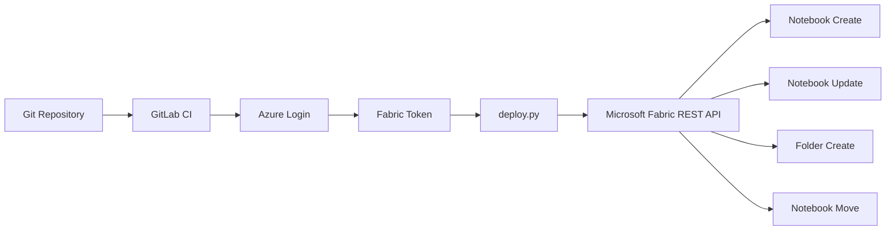

# Microsoft Fabric Notebook CI/CD Automation

> GitLab CI와 Microsoft Fabric REST API를 활용하여
> Jupyter Notebook을 Microsoft Fabric Workspace에 자동 배포하는 CI/CD 프로젝트


---

# Overview

Microsoft Fabric에서는 Notebook을 Workspace에 직접 생성하거나 수정하는 작업이 반복적으로 발생합니다.

수동 배포 방식은 다음과 같은 문제를 발생시킬 수 있습니다.

- Notebook 누락
- 버전 불일치
- 반복 작업 증가
- Git Repository와 Workspace 구조 차이
- 변경 이력 추적 어려움

이 프로젝트는 GitLab CI와 Microsoft Fabric REST API를 이용하여
Notebook 생성, 업데이트 및 Workspace 폴더 동기화를 자동화하기 위해 개발되었습니다.

---

# Features

- GitLab CI 기반 자동 배포
- Azure Service Principal 인증
- Microsoft Fabric Access Token 자동 발급
- Notebook Create / Update
- Repository Folder → Workspace Folder 자동 생성
- Folder Tree Mirroring
- Notebook Move API
- Item Visibility Polling
- Pipeline Log 출력

---

# Architecture



---

# Technology Stack

| Category | Technology |
|------------|----------------|
| Language | Python |
| CI/CD | GitLab CI |
| Cloud | Microsoft Fabric |
| Authentication | Azure Service Principal |
| API | Microsoft Fabric REST API |
| CLI | Azure CLI |

---

# Repository Structure

```text
Microsoft_Fabric_CICD/

├── DeployFile/
│
├── Script/
│     deploy.py
│
├── .gitlab/
│     gitlab-ci.yml
│
└── README.md
```

---

# Deployment Flow

Developer Push

↓

GitLab Pipeline

↓

Azure Login

↓

Fabric Access Token

↓

Notebook Search

↓

Notebook Create / Update

↓

Folder Create

↓

Notebook Move

↓

Deployment Complete

---

# Folder Mirroring

Repository

```text
DeployFile/

test/

sample.ipynb

test1/

sub/

abc.ipynb
```

↓

Fabric Workspace

```text
Workspace

test/

sample

test1/

sub/

abc
```

Repository 구조를 그대로 Workspace에 재현합니다.

---

# GitLab Variables

| Variable | Description |
|------------|----------------|
| AZURE_SERVICE_PRINCIPAL_ID | Client ID |
| AZURE_SERVICE_PRINCIPAL_PWD | Client Secret |
| AZURE_TENANT_ID | Tenant ID |
| FABRIC_WORKSPACE_ID | Workspace ID |

---

# Core Implementation

deploy.py에서 다음 기능을 수행합니다.

- Notebook 조회
- Notebook 생성
- Notebook 업데이트
- Folder 조회
- Folder 생성
- Folder Tree 생성
- Item Polling
- Notebook Move

---

# Pipeline

1. Notebook 검색

2. Azure Login

3. Fabric Token 발급

4. Notebook 생성

5. Folder 생성

6. Notebook 이동

7. Deployment 완료

---

# Current Limitations

- Notebook만 지원
- 동일 이름 Notebook 충돌 가능
- Rollback 미지원
- Delete Sync 미지원

---

# Future Improvements

- Pipeline 지원
- Lakehouse 지원
- Warehouse 지원
- Semantic Model 지원
- Delete Sync
- Incremental Deployment
- Retry Policy
- Rollback

---

# My Role

- GitLab CI 설계
- Azure 인증 구성
- Fabric REST API 구현
- Notebook Create / Update 구현
- Folder Mirroring 구현
- Item Polling 구현
- Deployment Script 개발

---

---

# Author

## 김민서 (Minseo Kim)

**Cloud AI Engineer / Azure Platform Engineer**

이 프로젝트는 Microsoft Fabric Notebook의 반복적인 수동 배포를 자동화하기 위해 직접 설계하고 구현한 개인 프로젝트입니다.

### 주요 구현 내용

- GitLab CI/CD Pipeline 설계 및 구현
- Azure Service Principal 기반 비대화형 인증 구성
- Azure CLI를 이용한 Microsoft Fabric Access Token 발급
- Microsoft Fabric REST API 연동
- Notebook Create / Update 자동화
- Base64 기반 Notebook Definition 배포 구현
- Repository Folder → Fabric Workspace Folder 미러링 로직 구현
- Folder 자동 생성 및 계층 구조 동기화
- Notebook Move API 구현
- Item Visibility Polling 구현
- 배포 로그 및 예외 처리 구현

---

## Contact

- GitHub : https://github.com/min-ser
- Email : (Optional)

---

## Acknowledgements

This project was independently designed and implemented by **Minseo Kim** as a technical portfolio to demonstrate Microsoft Fabric deployment automation using GitLab CI/CD and the Microsoft Fabric REST API.

The implementation reflects practical experience in designing deployment automation workflows, authentication, REST API integration, and CI/CD pipeline development.
